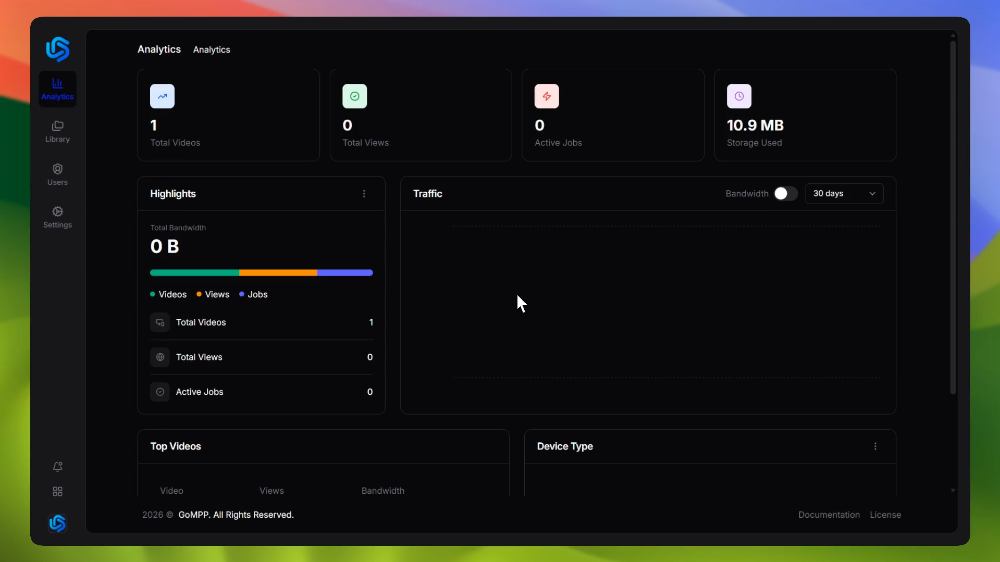

<p align="center">
  
</p>

<h1 align="center">GoMPP</h1>

<p align="center">
  Open-source video transcoding platform powered by FFmpeg.<br/>
  Upload, transcode, and deliver media at scale.
</p>

<p align="center">
  <a href="https://github.com/ardeanx/gompp/blob/main/LICENSE">License</a> ·
  <a href="https://docs.gompp.net">Documentation</a> ·
  <a href="https://github.com/ardeanx/gompp/issues">Issues</a> ·
  <a href="CONTRIBUTING.md">Contributing</a>
</p>

<p align="center">
  <a href="https://github.com/ardeanx/gompp/stargazers"></a>
  <a href="https://github.com/ardeanx/gompp/network/members"></a>
  <a href="https://github.com/ardeanx/gompp/issues"></a>
  <a href="https://github.com/ardeanx/gompp/blob/main/LICENSE"></a>
  <a href="https://github.com/ardeanx/gompp"></a>
  <a href="https://github.com/ardeanx/gompp/commits/main"></a>
</p>

---

## About



This project was inspired by something like Cloudflare Stream, Bunny Stream, Mux, and AWS MediaConvert. The goal is to create a self-hosted alternative that gives users full control over their media processing and delivery without relying on third-party services.

GoMPP is a self-hosted video transcoding and media management platform. It provides a modern web interface for uploading, transcoding, and organizing video content with support for multiple output formats and adaptive streaming.

## Features

- **Video Transcoding** — FFmpeg-based worker pool with configurable presets (H.264, H.265, VP9, AV1)
- **Adaptive Streaming** — HLS and DASH output with multi-bitrate ladder support
- **Media Library** — Upload, organize, search, and manage video assets
- **Subtitle Management** — Upload and attach subtitle tracks to videos
- **Storage Backends** — Local filesystem or S3-compatible object storage
- **Authentication** — Email/password, Google OAuth, and WebAuthn passkey support
- **Role-Based Access** — Admin and user roles with RBAC middleware
- **System Settings** — Configurable branding (logo, favicon, theme color) from the admin panel
- **Analytics Dashboard** — Video, storage, and job statistics at a glance
- **Observability** — Prometheus metrics and Grafana dashboards included
- **Docker Ready** — Full Docker Compose stack with Nginx, PostgreSQL, Prometheus, and Grafana

## Architecture

```
┌─────────────┐       ┌─────────────┐       ┌──────────────┐
│   Browser    │◄─────►│    Nginx     │◄─────►│   Next.js    │
│  (Client)    │       │   (Proxy)    │       │  (Frontend)  │
└─────────────┘       └──────┬──────┘       └──────────────┘
                             │
                      ┌──────▼──────┐       ┌──────────────┐
                      │   Go API    │◄─────►│  PostgreSQL   │
                      │  (Chi v5)   │       │   (Database)  │
                      └──────┬──────┘       └──────────────┘
                             │
                 ┌───────────┼───────────┐
                 ▼           ▼           ▼
          ┌──────────┐ ┌──────────┐ ┌──────────┐
          │ FFmpeg   │ │ FFmpeg   │ │ FFmpeg   │
          │ Worker 1 │ │ Worker 2 │ │ Worker N │
          └──────────┘ └──────────┘ └──────────┘
                             │
                      ┌──────▼──────┐
                      │   Storage   │
                      │ (Local / S3)│
                      └─────────────┘
```

- **Frontend** — Next.js with React, Tailwind CSS, and shadcn/ui components
- **Backend** — Go with Chi router, structured as handler → service → repository layers
- **Transcoding** — Concurrent FFmpeg worker pool with real-time progress tracking
- **Storage** — Pluggable backends: local filesystem or any S3-compatible service

## Tech Stack

| Layer        | Technology                            |
| ------------ | ------------------------------------- |
| Frontend     | Next.js, React, TypeScript, Tailwind  |
| Backend      | Go 1.25, Chi v5, pgx                 |
| Database     | PostgreSQL 16                         |
| Transcoding  | FFmpeg                                |
| Auth         | JWT, Google OAuth2, WebAuthn          |
| Storage      | Local filesystem, S3                  |
| Observability| Prometheus, Grafana                   |
| Deployment   | Docker, Nginx                         |
| Package Mgr  | Bun (frontend)                        |

## Quick Start

### Prerequisites

Go 1.25+, Node.js 22+, Bun, PostgreSQL 16+, FFmpeg

### Local Development

```bash
git clone https://github.com/ardeanx/gompp.git
cd gompp
cp .env.example .env
# Edit .env — set GOMPP_JWT_SECRET at minimum

# API
go run ./server

# Frontend (separate terminal)
cd web
bun install
bun run dev
```

### Docker Deployment

```bash
cd deployments
cp ../.env.example ../.env
# Edit ../.env with your configuration

docker compose up --build
```

Services will be available at:

| Service    | URL                    |
| ---------- | ---------------------- |
| App        | <http://localhost>       |
| API        | <http://localhost:8080>  |
| Frontend   | <http://localhost:3000>  |
| Grafana    | <http://localhost:3001>  |
| Prometheus | <http://localhost:9090>  |

## Notice

GoMPP is under active development. APIs and database schemas may change between versions. Back up your data before upgrading.

For full documentation, visit [docs.gompp.net](https://docs.gompp.net).

## Contact

- **Email**: <ardeanbimasaputra@gmail.com>
- **Telegram**: [@ardeanbimasaputra](https://t.me/ardeanbimasaputra)
- **GitHub Issues**: [gompp/gompp/issues](https://github.com/ardeanx/gompp/issues)

---

## License & Copyright

GoMPP is licensed under the MIT License. See [LICENSE](LICENSE) for details. Copyright (c) 2026 Ardean Bima Saputra. All rights reserved.

---

<p align="center">
  2026 From Ardeanx Made with ❤️
</p>
